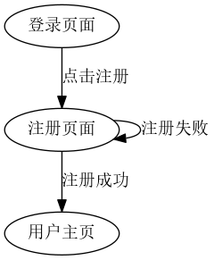
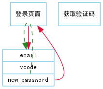

# 1.引言

本文是电信学院物资平台的设计说明书。

按流程，应该是先有概要设计，再有详细设计，
但由于工期紧张，文档编写者缺乏经验等原因，
本设计说明书把两步合为一步，固称作设计说明书。

## 1.1 编写目的

本文的对象是平台开发者，为他们提供一个详细的开发指引。

## 1.2 项目背景

本平台是为电信学院学生会更加方便管理物资而建设。

## 1.3 定义

平台：电信学院物资管理平台
本文、说明书：电信学院物资管理平台设计说明书
开发者：平台开发者

## 1.4 参考资料

电信学院物资平台 V1.0 产品需求说明书

# 2. 任务概述

## 2.1 目标

编码实现电信学院 V1.0 版本。

## 2.2 运行环境

LNMP——Linux,Nginx,MySQL,PHP

## 2.3 需求概述

实现物资申请、物资信息修改等功能。

## 2.4 条件和限制

在寒假(2015.01.16-2015.03.01)之内完成。

# 3. 总体设计

## 3.1 模块设计

### 3.1.1 登录模块

登录模块主要用于用户登入和登出。

#### 流程图

### 3.1.2 用户模块

用户模块有注册、找回密码、更改密码、更改用户信息等功能。

#### 流程图

