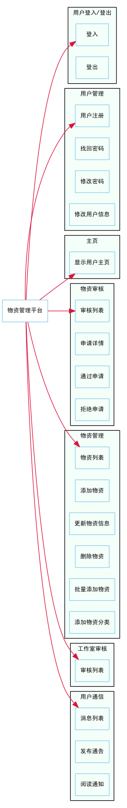
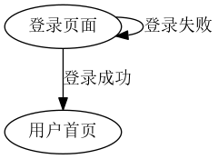
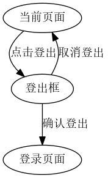

% 电信学院物资平台设计说明书
% 谢伟能
% \today

# 引言

本文是电信学院物资平台的设计说明书。

按流程，应该是先有概要设计，再有详细设计，
但由于工期紧张，文档编写者缺乏经验等原因，
本设计说明书把两步合为一步，固称作设计说明书。

## 编写目的

本文的对象是平台开发者，为他们提供一个详细的开发指引。

## 项目背景

本平台是为电信学院学生会更加方便管理物资而建设。

## 定义

平台：电信学院物资管理平台
本文、说明书：电信学院物资管理平台设计说明书
开发者：平台开发者

## 参考资料

电信学院物资平台 V1.0 产品需求说明书

# 任务概述

## 目标

编码实现电信学院 V1.0 版本。

## 运行环境

LNMP——Linux,Nginx,MySQL,PHP

## 需求概述

实现物资申请、物资信息修改等功能。

## 条件和限制

在寒假(2015.01.16-2015.03.01)之内完成。

# 总体设计

## 功能架构



平台包括申请/审核系统和管理系统两部分，主要有：

- 用户登录/登出
- 用户管理
- 主页
- 物资申请/审核
- 工作室申请/审核
- 物资管理
- 工作室管理
- 用户通信

## 系统架构

本平台采用MVC的3层架构，主要包括：表现层、控制层、业务层。

表现层：主要负责用户交互和结果显示。
控制层：主要负责系统的控制访问、数据加载。
业务层：主要负责系统和数据库的交互。

用户 ←→ 表现层 ←→ 控制层 ←→ 业务层 ←→ 数据库

## 模块设计

### 登录模块

登录模块主要用于用户登入和登出。

#### 用户登入



#### 用户登出



### 用户模块

用户模块有添加帐号、更改密码、删除账号、修改用户信息等功能。

#### 添加帐号

只有管理员可以向系统添加帐号，不予注册。

#### 更改密码

只有管理员可以更改密码，用户不可以。

#### 删除帐号

管理员可以删除其他帐号。

#### 更改用户信息

管理员可以更改用户的权限、昵称等信息。

### 主页模块

主页模块是用户登录后的页面，包含

- 用户信息
- 申请/审核记录，包含两部分，自己个人的和所有人的，按时间排序，点击切换
- 物资列表

### 物资申请/审核模块

本模块有查看审核列表、查看详情、通过申请、拒绝申请等功能。

#### 申请物资

所有用户都可以在此页面申请物资。

#### 申请列表

审核员可以在此页面查看所有的物资申请。

#### 查看详情

审核员可以在此页面查看某一物资申请的具体情况，
包括申请时间、申请人、申请原因、申请物品等等。

#### 通过申请

通过一个或多个申请。

#### 拒绝申请

拒绝一个或多个申请，并填写拒绝原因。
当批量拒绝时，所有都是同一拒绝原因。

### 物资管理模块

本模块有物资一览、添加物资、更新物资、删除物资、上传物资、添加分类、删除分类等功能。

#### 物资一览

展示所有的物资情况。

#### 添加物资

添加单个物资。

#### 删除物资

删除单个或多个物资。

#### 上传物资

上传excel文件，批量增加物资。

#### 添加分类

添加单个物资分类。

#### 删除分类

删除单个物资分类。

### 工作室审核模块

本模块有查看申请列表、通过申请、拒绝申请等功能。

#### 查看申请

审核员可以在此页面查看所有未审核的物资申请。

#### 通过申请

通过用户的工作室申请。

#### 拒绝申请

拒绝用户的工作室申请。

### 工作室管理模块

本模块暂无需求。

### 用户通信模块

本模块有发送通知、阅读通知、查看通知等功能。

#### 发送通知

在审核员审核结束后，系统会自动发通知给用户。
管理员也可以发通知给任何用户。

#### 查看通知

用户在此页面查看所有发给自己的信息列表。

#### 阅读通知

用户在此阅读某一通知的内容。

## 数据库设计

### 用户信息

#### user表

| Field               | Type             | Null | Key | Default             | Extra          |
|---------------------|------------------|------|-----|---------------------|----------------|
| id                  | int(10) unsigned | NO   | PRI | NULL                | auto_increment |
| username            | varchar(255)     | NO   | UNI | NULL                |                |
| nickname            | varchar(255)     | NO   |     | NULL                |                |
| email               | varchar(255)     | NO   |     | NULL                |                |
| phone               | varchar(255)     | NO   |     | NULL                |                |
| password            | varchar(255)     | NO   |     | NULL                |                |
| permissions         | text             | YES  |     | NULL                |                |
| activated           | tinyint(1)       | NO   |     | 0                   |                |
| activation_code     | varchar(255)     | YES  | MUL | NULL                |                |
| activated_at        | timestamp        | YES  |     | NULL                |                |
| last_login          | timestamp        | YES  |     | NULL                |                |
| persist_code        | varchar(255)     | YES  |     | NULL                |                |
| reset_password_code | varchar(255)     | YES  | MUL | NULL                |                |
| created_at          | timestamp        | NO   |     | 0000-00-00 00:00:00 |                |
| updated_at          | timestamp        | NO   |     | 0000-00-00 00:00:00 |                |

ID

username                *用户名

password                *密码

#### 角色role

admin                   管理员，相当于超级管理员状态，拥有除审核外的所有权限

checker                 审核员，拥有普通用户和审核的权限

user                    普通用户，拥有申请物资，浏览物资等基本功能

### 物资信息

#### material物资表

ID

name                    物资名称

type                    物资分类

sum_n                   物资数量（总数）

borrow_n                物资借出数量

create_time             物资生成时间

update_time             物资更新的时间

description             对物资的描述（备注）

status                  （留用）

comment                 （留用）

### 申请/审核表

#### application表

ID

user_id                 用户id

checker_id              审核者id

reason                  申请原因

response                审核结果

request_time            申请时间

response_time           审核时间（即为审核员回应的时间）

borrow_time             借出时间（或预计借出时间）

return_time             归还时间（预计归还时间）

status                  申请状态（pass：审核通过； refuse：拒绝通过；  waiting：未审核 ）

#### apply_resouce表

ID

application_id          申请的id号 

resource_id             物资的id号

number                  数量

comment                 备注

### 工作室/会议室表

和物资的表可重用

### 通知信息

#### notice表

ID

from_user               来自哪个用户

content                 通知内容

push_time               通知推送的时间


#### notic_to_user表

ID

notice_id               通知（notice）表的id

user_id                 接收方的id

status                  消息状态（已读、未读等）                

# 详细设计

## 登录模块

### 功能

本模块主要实现用户的登入和登出功能。

### 输入输出

#### 登入

在URL 'http://example.com/login.php' 填写以下表单，
`POST` 到 'http://example.com/login.php'

- username
- password
- remember_me

验证成功后跳转到 '首页'

#### 登出

点击 '登出按钮' -> `js` 弹出确认框，内容是一个 `delete` 表单 ->
点击 '确认按钮' -> 提交 `delete` 表单到 'htto://example.com/logout.php' ->
跳转回'登入页面'

### 接口

```php
interface AuthInterface {
    public function getLogin();
    public function postLogout();
    public function delLogin();
}
```

## 用户模块

### 功能

本模块实现添加帐号、删除账号、修改用户信息等功能。

### 输入输出

#### 添加帐号

管理员在 'http://example.com/user/create' 页面填写以下表单，
然后 `POST` 到 'http://example.com/user' 完成添加。

- username
- nickname
- password
- role

#### 更改用户信息

管理员在 'http://example.com/user/{id}/edit' 页面填写以下表单，
然后 `PUT` 到 'http://example.com/user/{id}' 完成修改。

- username
- nickname
- password
- role

#### 删除帐号

管理员发 `DELETE` 申请到 'http://example.com/user/{id}'，
完成删除。

### 接口

```php
interface UserInterface {
    public function getUser();
    public function getUserCreate();
    public function postUserCreate();
    public function getUserUpdate();
    public function putUserUpdate();
    public function delUser();
}
```

## 首页模块

### 功能

本模块的功能是显示首页。

### 输入/输出

`GET` 'http://example.com' 就是首页

### 接口

```php
interface HomeInterface {
    public function getIndex();
}
```

## 物资管理模块

## 物资申请模块

### 功能

本模块实现用户申请物资、查看申请列表、审核员审核申请的功能。

### 输入/输出

#### 查看申请列表

`GET` 'http://example.com/application' 是查看申请列表，
普通用户只能看到已通过的申请，审核员和管理员可以看到全部申请。

#### 申请物资

首先，用户 `GET` 'http://example.com/application/create' 打开申请页面，
填写以下表单，然后 'POST' 到 'http://example.com/application' 完成申请。

- 物资
- 申请时间
- 归还时间
- 申请理由
- 用户信息

#### 通过/拒绝申请

`PUT` 通过/拒绝理由到 'http://example/application/{id}' 完成操作。

### 接口

```php
interface ApplicationInterface {
    public function getApplicationCreate();
    public function postApplication();
    public function getApplicationUpdate();
    public function putApplicationUpdate();
    public function delApplication();
}
```
